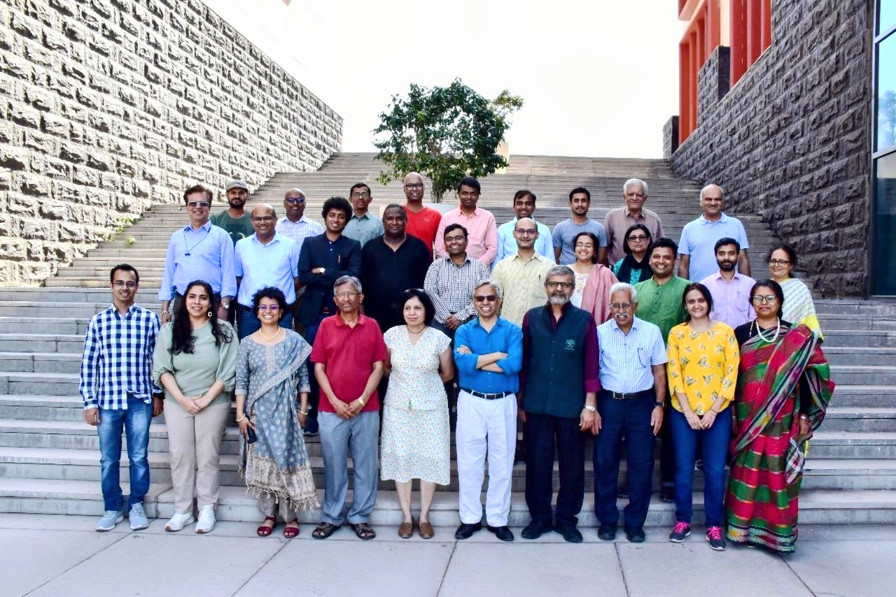
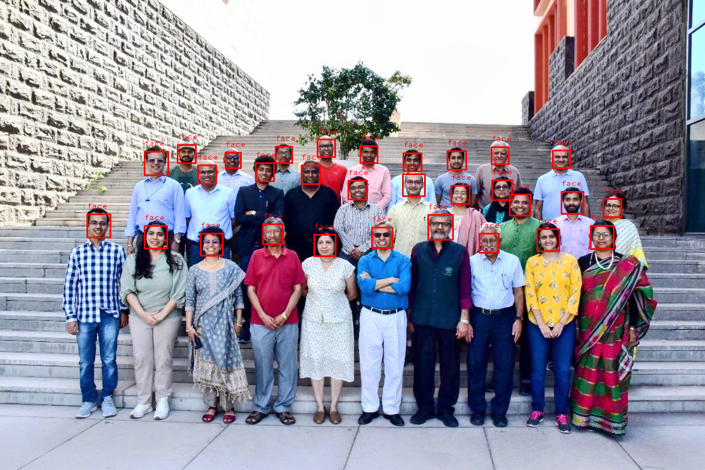
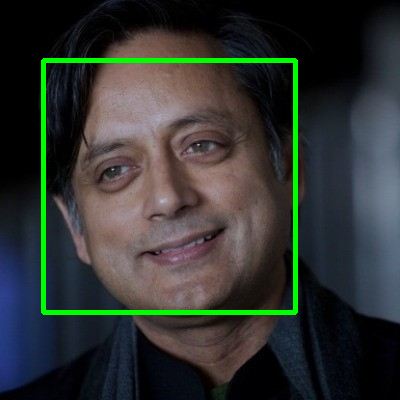
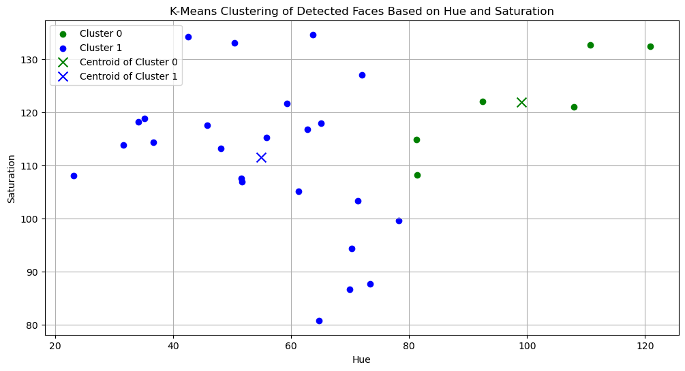
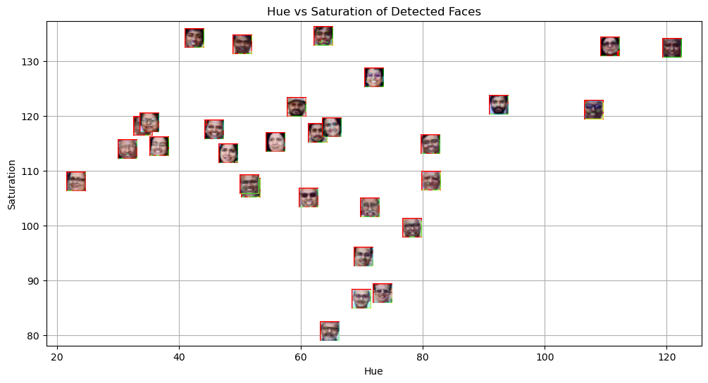
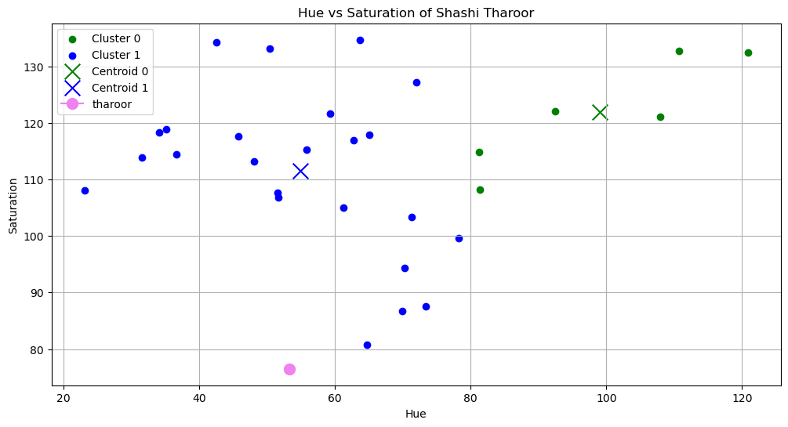

# Lab 5

## Aim
In this lab I try a simple pipeline: detect faces, summarize each face by color (hue and saturation), then cluster the faces and see where a new face fits in.

## Methodology
- Detect faces in `Plaksha_Faculty.jpg` using a Haar cascade.
- Convert each face region to HSV and compute mean hue/saturation.
- Cluster the faces with k-means ($k=2$) and visualize the hue vs. saturation space.
- Detect the face in `Dr_Shashi_Tharoor.jpg`, compute its hue/saturation, and predict its cluster label using the trained model.

## Key Findings
- The faculty faces separate into two groups based on their hue/saturation values.
- The template face (Shashi Tharoor) lands cleanly in one of those groups.

## Conclusions
Color-based features are a quick way to get a rough grouping, but results are sensitive to lighting and image quality. For stronger results, I would add normalization or use richer features.

## Visuals
### Input Images

### Notebook Plots

